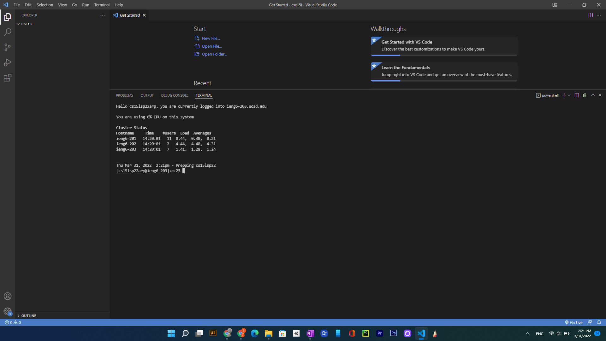
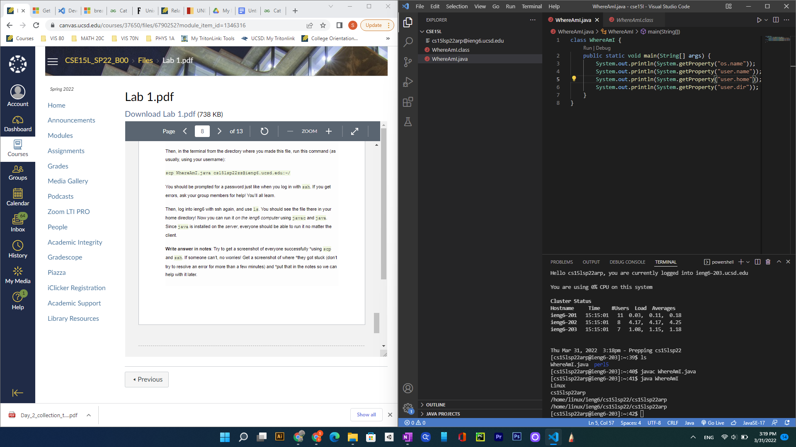

# Week 2 Lab Report: How to log into a course-specific account on ieng6

## Installing VScode:
To install Visual Studio Code, navigate to the vscode website, https://code.visualstudio.com/download, simply click on the download option corresponding to the operating system the computer you are installing on. Follow the instructions provided by the installer and open the downloaded application. In my case, I already installed Visual Studio Code; here is the screenshot of the page upon opening the application.

## Remotely Connecting:
Open the terminal in VSCode by clicking on the “Terminal” part of the menu bar at the top; then click on “New Terminal” in the drop down. A new terminal section should appear at the bottom right.
Type into the terminal, `$ ssh cs15lsp22zz@ieng6.ucsd.edu` wherein you replace zz with the unique letters of your account for this class. Keep in mind that if you’re taking this course in a different year and quarter from spring 2022, the “sp22” part might also be different.
The first time you try this, you should get a prompt telling you the authenticity of the host can’t be established and asking whether you want to continue connecting. Respond “yes” and you’ll get a prompt warning that the “host” has been permanently added to the list of known hosts. These prompts should not appear the next time you try to connect from this computer.
You will then be prompted with a “Password:”, type your password for the account into the terminal (your typed letters will not appear, but this is normal and is simply meant to protect your password from curious eyes).

Upon successful login, you should see something like this, with a welcome and information on CPU usage and cluster status. Further, the front part of the place you type in your commands that holds your “address” should have changed to include the account@ieng6 in brackets and no longer display your location in your local computer. For me, the previous commands I’d entered disappeared upon successful login, but this did not happen for my other groupmates, and some group mates were given privacy warnings due to multiple failed login attempts.
## Running Some Commands:

Here is me trying some commands, ls lists the files in the directory. However, because cse15lsp22aro is a different account in the server, I do not have permission to access or view the files in that directory/account. Similarly, cat `<filename>` will view a file, so my command is trying to view a file in the public folder of spring 22, which we do not have access to. As a result, for each command, we receive a response that permission is denied.

### Here are some more interesting commands:
I listed the files with ls, and adding -l shows more information of the files (long), -a shows hidden files, -t sorts the files by time. These commands can be combined to form `ls -lat` which does all three.
These commands of -l, -a, -t do not work on my Windows computer, though it does work when remotely connected to the computer. If run from the command prompt rather than the VSCode terminal, ls does not work and I have to use dir instead. 

## Moving Files over SSH with SCP:

Type in scp `<fileNameofFileYouWantToCopy> account@ieng4.ucsd.edu:~/`, as I did here. I kept on forgetting the `:~/` and this caused me to spend a lot more time on this step than I should have redoing this step. After, you will be prompted with “Password:” like before, try writing the password somewhere else and copy-pasting it in, this is what I did later on, and it minimized errors. Upon inputting the correct password, you will see a line like the one above that has the file name, and various information on the file and its copying.

To run this file on the server, compile with javac fileName, and java className. In this case, WhereAmI prints the Operating system and user to the terminal/console, when run on the client, you get the client computer’s information on the user and OS name (ex. Windows10, sue). On the server it prints the server’s information on the user and OS (Linux, cs15lsp22arp).
Setting an SSH Key:

## SSH Keys
To avoid having to type in our password every time we try to connect to the ieng6 server, we can create an SSH key. To create this, I created a directory with `mkdir .ssh` in my local computer (disconnect with the ieng6 server if you haven’t already), this will create a hidden folder/directory of ssh. Then, I navigated to this directory and generated a public and private key on my local computer: As a Windows user, I used the command `ssh-keygen -t ed25519`, UNIX users may use `ssh-keygen`. If successful, you should see a line about “generating a public/private … keypair”, you will also see prompts asking you to enter the file you want to save it at (you should see its address it will be saved at if nothing is entered in the parenthesis, this address should be in the .ssh directory) and to enter a passphrase. Press enter for both, we’re fine with the location and we do not want a passphrase. In my case, I tried multiple times to create these keys, as such, after my first time, I received an additional prompt on whether I wanted to overwrite my previous keys. I chose yes.
Then, I connected remotely to the ieng6 server as detailed prior, and made a directory of .ssh (with “mkdir .ssh”). Then I closed my connection with “exit”.
Then I copied the public key, “id_rsa.pub” to the .ssh of my account of the server with the scp method I detailed earlier: typing `scp <address of id_rsa.pub> <location I want id_rsa.pub to be in in the ieng6 server>`, entering password when prompted, seeing the information of its copy as confirmation.
Now, when we remotely connect, after typing in ssh account@ieng6.ucsd.edu, we should immediately login.
## Making Remote Running Even More Pleasant (Optimizing Remote Running):
Particularly helpful for speeding up Remote Running is to use the up arrow to get previously entered commands, like I did when looking for commands like javac or java. Further, using the semicolons to run multiple commands without typing one, running one, and then the other was particularly helpful.
Another helpful optimization is to do `ssh account@ieng6.ucsd.edu “<comand1>; <command2>”`, which should run the two commands on the remote server.
