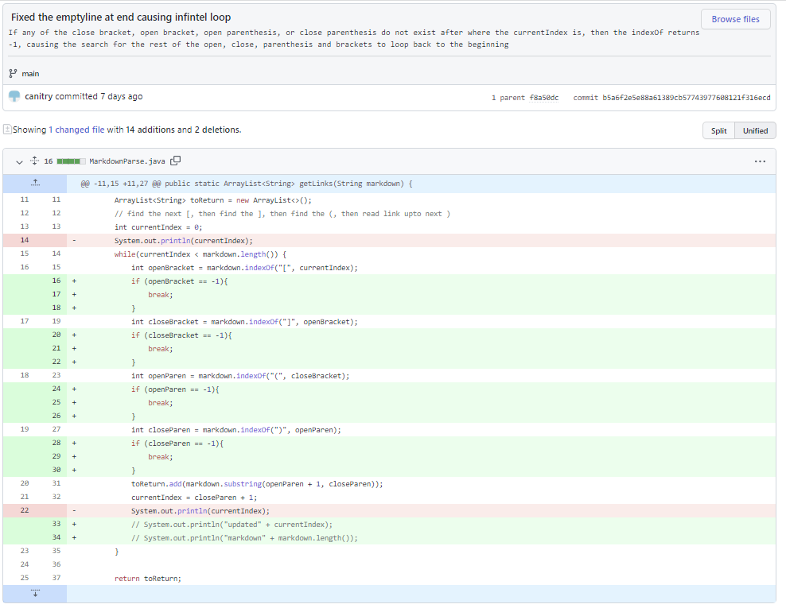
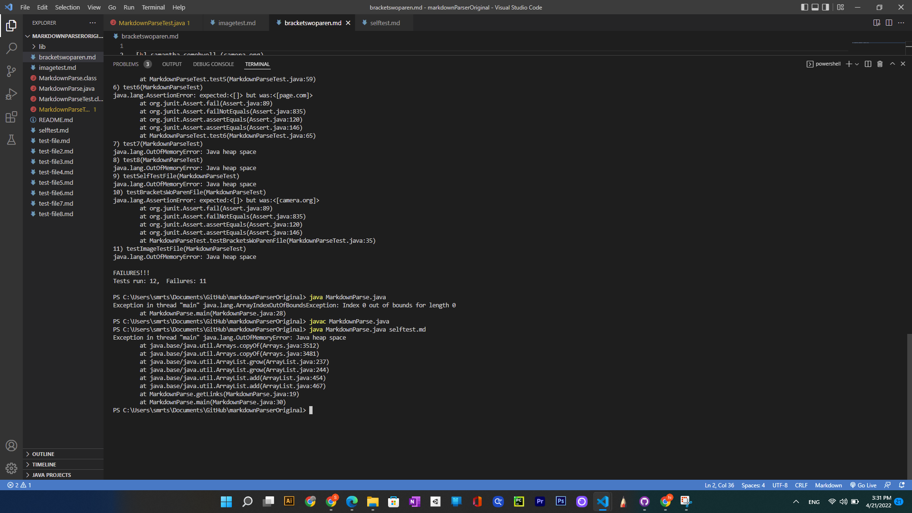
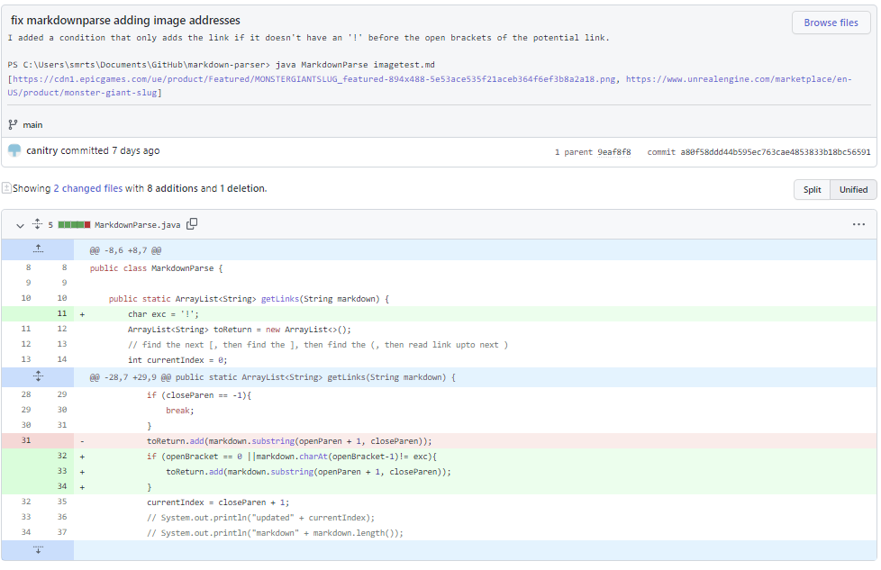
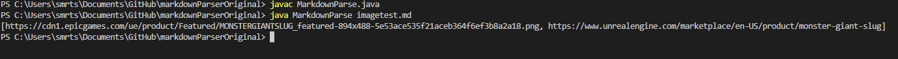
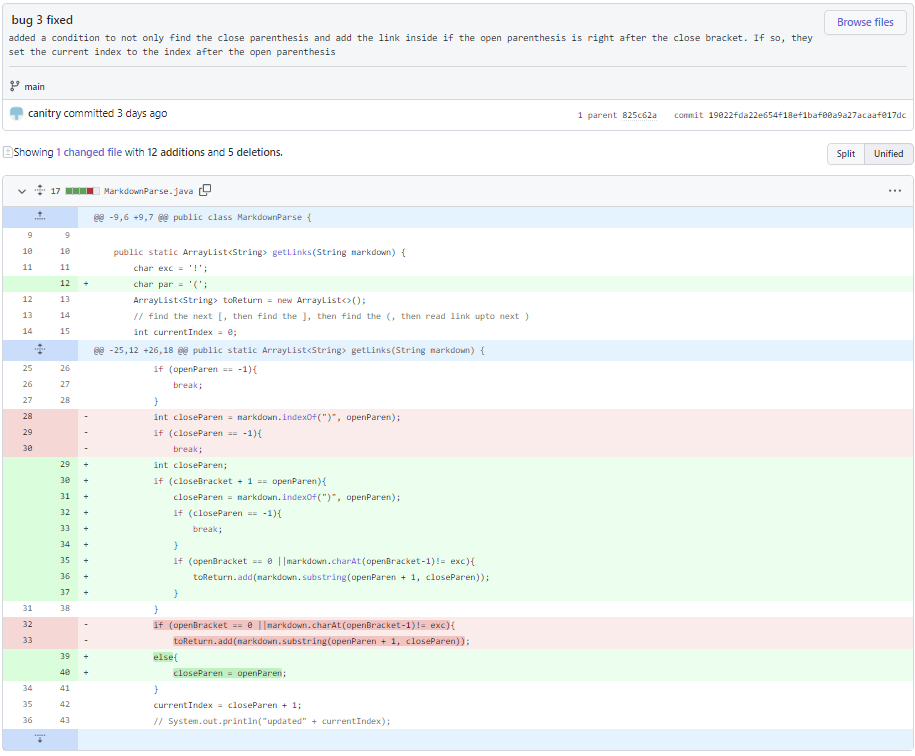
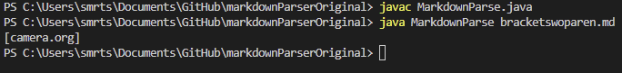

# Lab Report 2
## Code Change 1: Empty line/extra characters cause an infinite loop

[The test file with the failure-inducing input for error 1](https://github.com/canitry/markdown-parser/blob/4de78a630142b5ed7e395cd9f18f15258d8490e9/selftest.md)

There were two bugs, the first is that if any of the [, ], (, ) did not exist from the index we were searching from to the end of the file, the value returned to the variable meant to store the [, ], (, or )'s index would be -1. Since we use that value to search for the next [, ], (, or ), we would be searching from the beginning again. 

The second was that if the close parenthesis was not at the last index of the file (and so at the very end of the file), the currentIndex would still be less than the length of the markdown even though there aren't any )'s anymore and perhaps even [, ], and ('s, yet the while loop would not be broken, and so, when the code would search for the [, ], (, and ) again, it would return a -1 to the index value of the relevant [, ], (, or ), and start searching from the beginning all over again.

These bugs together cause the symptom of the infinite loop when I run my test due to the failure inducing input of having an \n at the very end of the file since the last close parenthesis would be less than the length of the file even though there are no more [, ], (, )'s and so would constantly go back to the beginning, search for the [, ], (, )'s and return -1 as the index because there are no more [, ], (, or )'s and loop to the beginning again.

## Code Change 2: Image addresses are considered links
Error 2's Fix

The test file with the failure-inducing input for error 2
[The test file with the failure-inducing input for error 2](https://github.com/canitry/markdown-parser/blob/4de78a630142b5ed7e395cd9f18f15258d8490e9/imagetest.md)

Error 2's symptom of the failure inducing input

The bug was that the code just looked for [, ], (, and )'s and inserted the stuff inside the parenthesis into the list of links. This meant it didn't differentiate between images (brackets and parenthesis directly preceded by a !) and links (brackets and parethesis without a ! infront of the [).

This bug cause the symptom of image addresses being included in the array as a link, such as in the case of our failure-inducing input, "https://cdn1.epicgames.com/ue/product/Featured/MONSTERGIANTSLUG_featured-894x488-5e53ace535f21aceb364f6ef3b8a2a18.png" being included as a link even though it was inside ``'s parentheses.

 The failure inducing input was including an image address in the test, which meant the code would read the [, ], (, and ) and consider the stuff inside the parenthesis as a link and include it. 

## Code Change 3: Brackets and parenthesis separated by other characters are still considered one link
Error 3's Fix

The test file with the failure-inducing input for error 3
[The test file with the failure-inducing input for error 3](https://github.com/canitry/markdown-parser/blob/4de78a630142b5ed7e395cd9f18f15258d8490e9/bracketswoparen.md)

Error 3's symptom of the failure inducing input

The bug was that the code just looked for [, ], (, and ) and if they all existed in a sequence (as in there was a [, and then somewhere after it there was a ] and then somewhere after than there was a (, and then somewhere after that there was a ))without a preceding "!", they would insert the stuff between the "(" and ")"'s they found into the list of links.

This causes the symptom of brackets and parentheses separated by text, spaces, and other characters still being considered a link by the code and having the content inside the parentheses added to the list. In the case of our failure inducing input, the addition of "camera.org" as a valid link even though the brackets and parentheses were separated by " samantha.comohwell ".

The failure inducing input of my test was including a pair of brackets separated by text from the pair of parentheses, which caused the symptom wherein the text inside the parentheses is included in the list of links.