# Lab Report 3
## Streamlining ssh Configuration
### My `.ssh/config` file, I edited the file using Notepad.
This is the config file in my directory
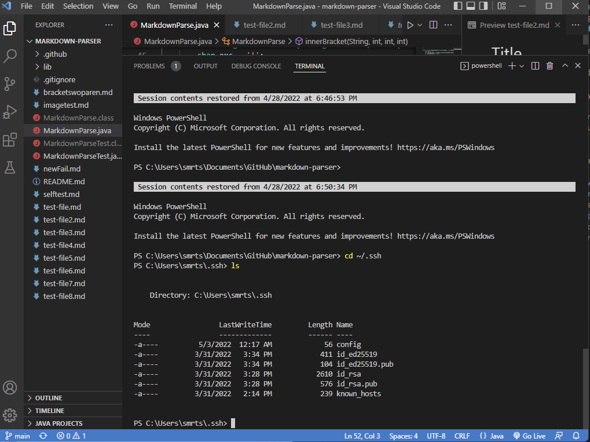
I used the following command `notepad config` to open the file in notepad
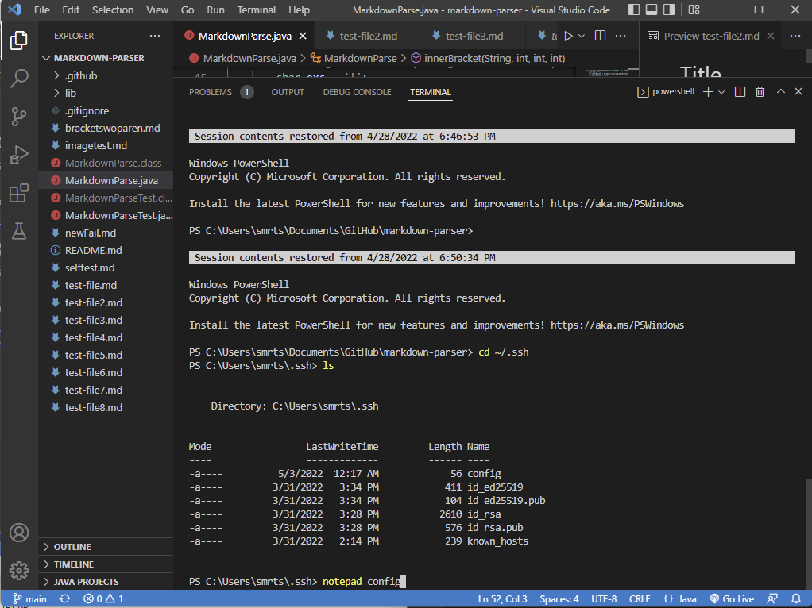
This is the config file open in notepad, you can see the necessary lines inside 
`Host ieng6` 
    \<tab\> `HostName ieng6.ucsd.edu` 
    \<tab\> `User cs15lsp22zzz (use your username)` 
ieng6 is the name of the key that I can now use in place of the entire cs15lsp22zz@ieng6.ucsd.edu I used before.
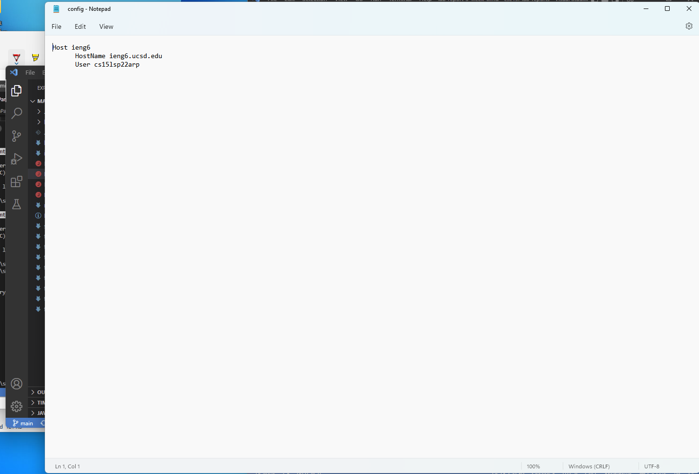
### The ssh command logging me into my account using the alias ieng6
Now, I can use the key to ssh in with `ssh ieng6`.
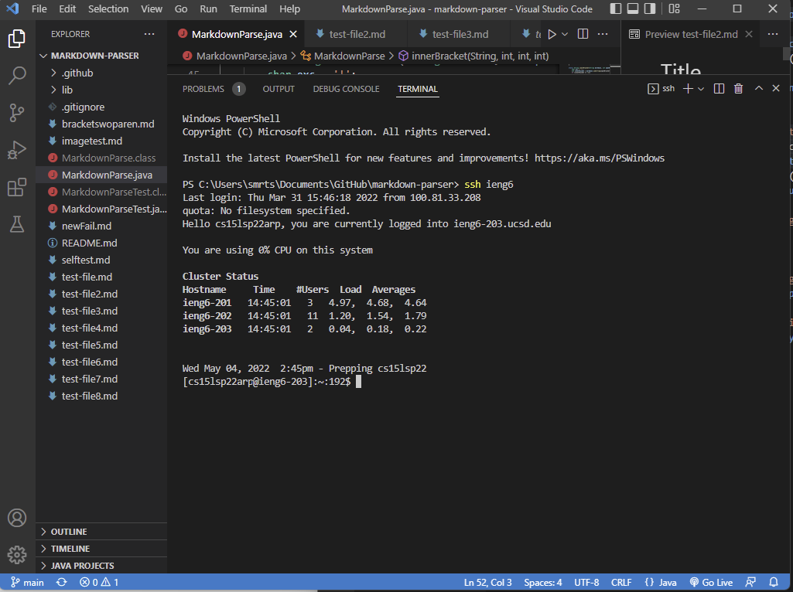
### An scp command copying a file to my account using the alias I chose.
Use the general form `scp` \<file/directory\> `ieng6:~/` where `ieng6:~/` is serving as our destination, `~/` indicating to put it in ieng6's home directory.
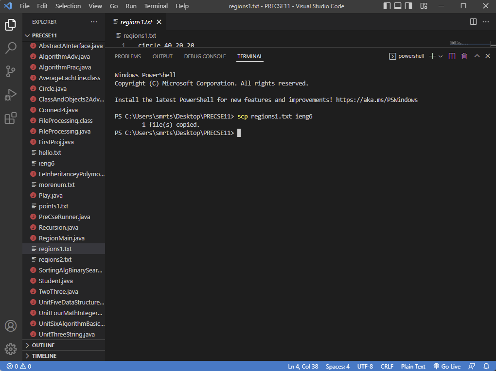
## Setup Github Access from ieng6
### Location of public key in Github and in user account
The location of my public key in Github
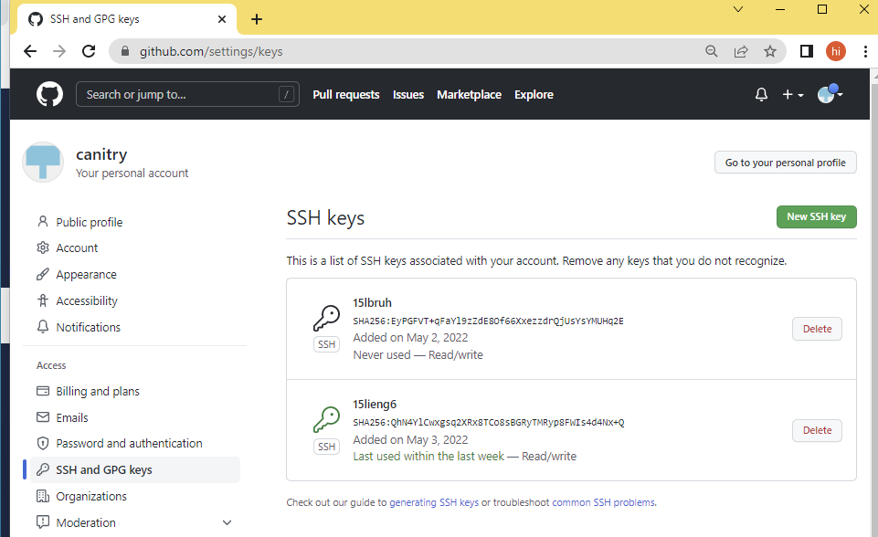
The location of my public key `id_rsa.pub` in my user account
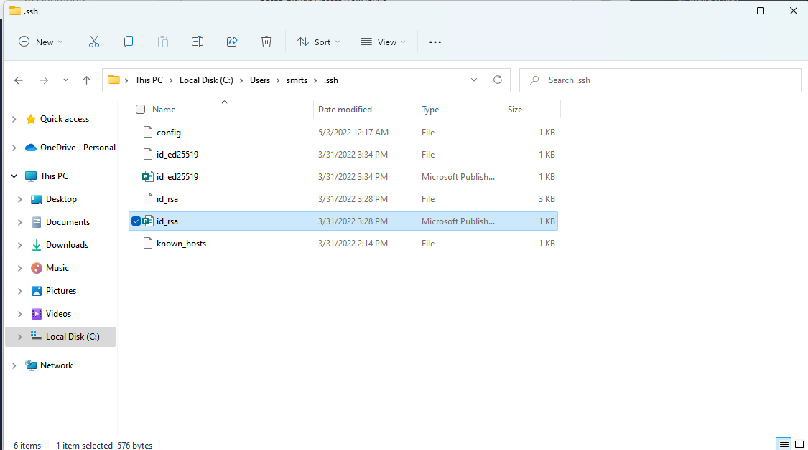
The location of my public key `id_rsa.pub` in my user account through the terminal

### Location of private key in user account
The location of my private key `id_rsa` in my user account

The location of my private key `id_rsa` in my user account through the terminal

### Running `git` commands to commit and push changes to Github while logged in ieng6
Note: when you're git cloning you want to use the SSH instead of the HTML, you can see it in this [post](https://stackoverflow.com/questions/14762034/push-to-github-without-a-password-using-ssh-key), but it'll still ask you for a token or password and username if you use the HTML, you can, however update something you cloned initially with HTML to SSH. (you do this with `git remote set-url origin git@github.com:`\<Username\>/\<Project\>`.git` (by the way, `git@github.com:`\<Username\>/)\<Project\>`.git` is just the SSH URL of your project)
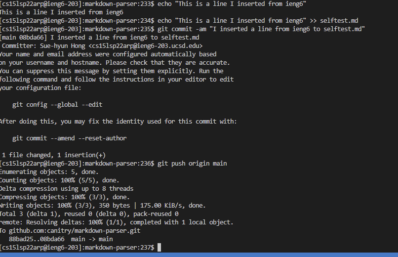 
[link to resulting commit](https://github.com/canitry/markdown-parser/commit/08bda667b47647ea90cca53dd0f9467636653371)
## Copying whole directories with scp -r
### Copying whole markdown-parse directory to my ieng6 account
the `.` indicates that we're copying the entire working directory (the directory we're on) and the stuff inside that directory -r I means "recursive" and allows it to copy the working directory and also the directories inside that directory (tells scp to work recursively) 
(The screenshot's been split into two because I couldn't fit it in one screen.)
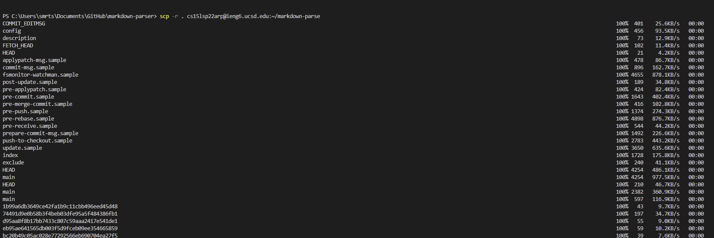 
... 
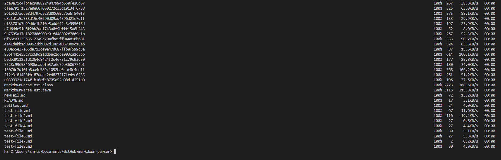
### Logging into my ieng6 account after copying directory and compiling and running tests from my repository
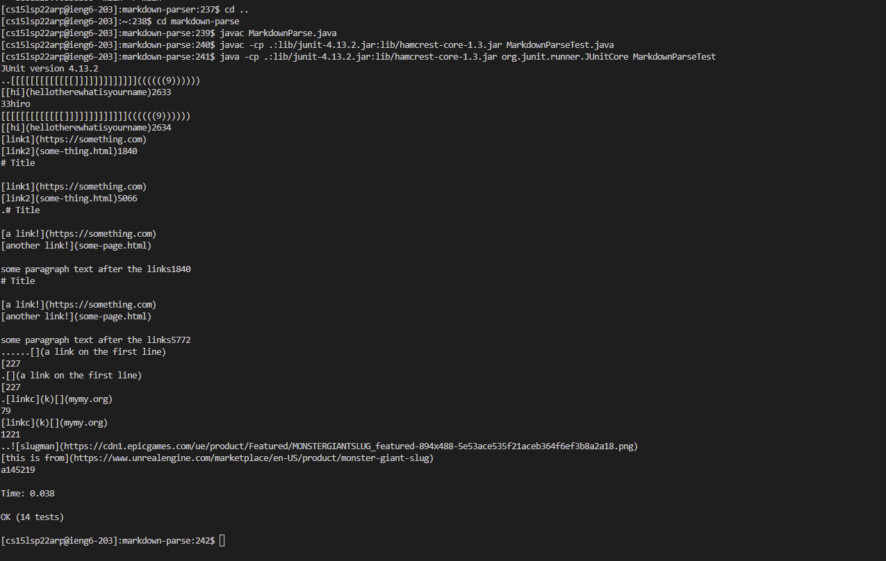
### Combining `scp`, `;`, and `ssh` to copy the whole directory and run the tests in one line.
I was unable to do this, and the TA's were unable to provide a solution, I both used direct commands and makefile but it failed because it could not find symbols such as Path.of or readString, I have posted on Piazza and will update the below images if I find a solution:
<!--  -->
Failing with normal method
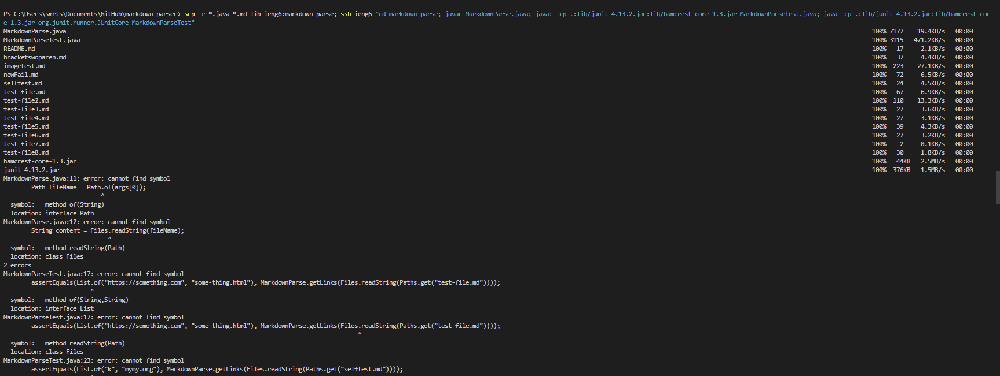
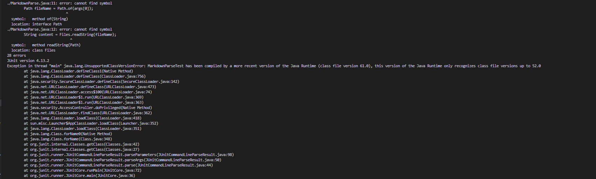
Failing with make test and showing that running the same commands while logged into ieng6 works
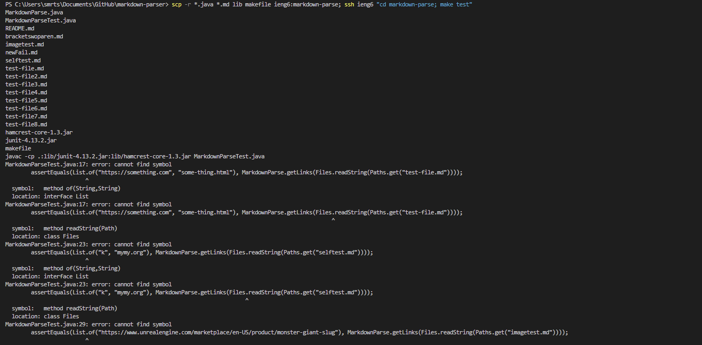
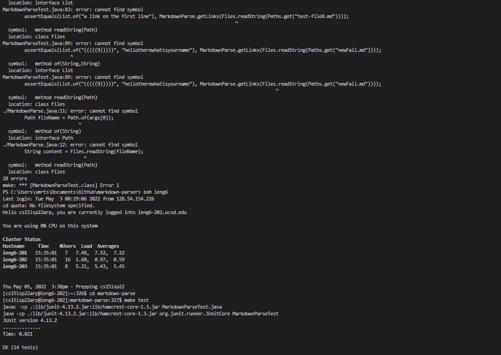