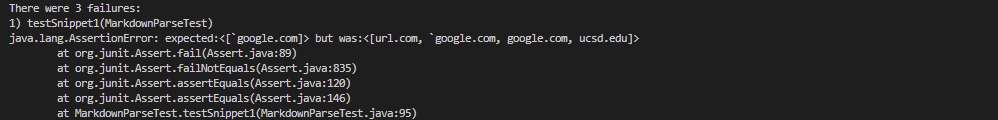
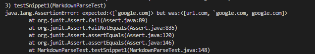
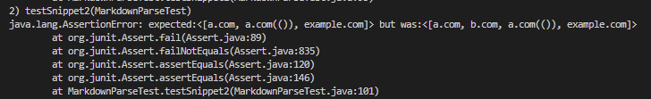
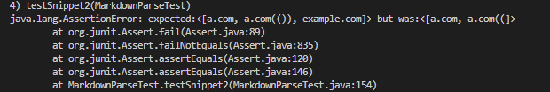
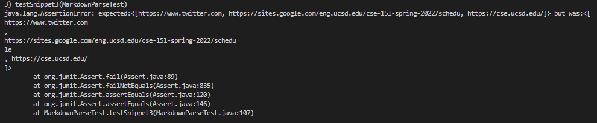
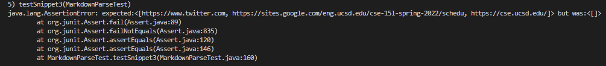
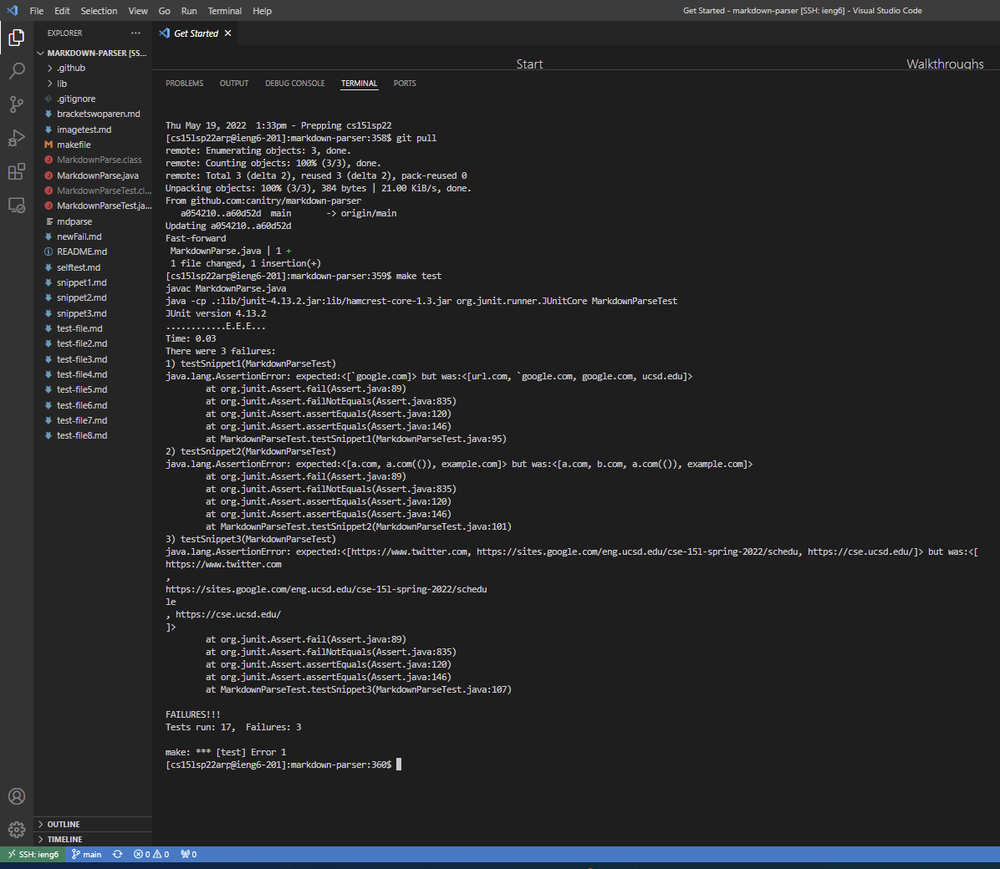
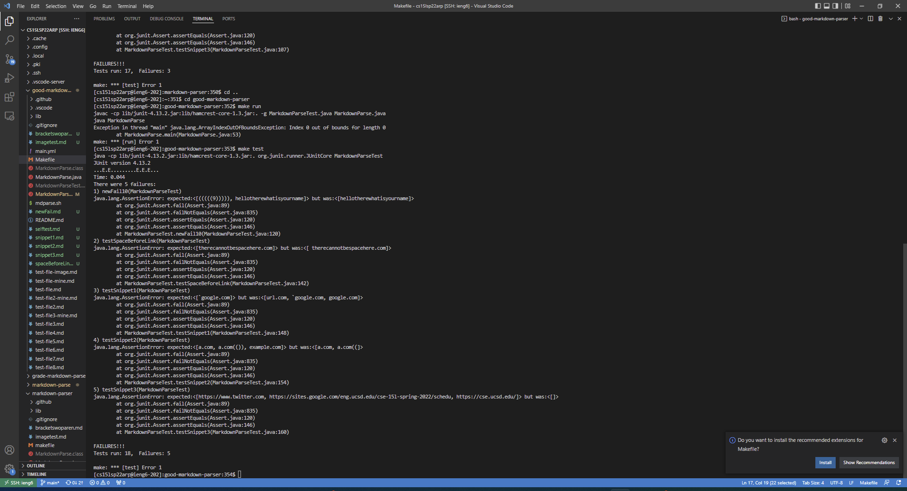

# Lab Report 4

[Link to my markdown-parse repository](https://github.com/canitry/markdown-parser)

[Link to reviewed-markdown-parse repository](https://github.com/ryankosta/good-markdown-parser)

Each snippet's expected output was decided based on the VSCode preview and how the actual markdown file was displayed in Github.

# Snippet 1:
```
`[a link`](url.com)
[another link](`google.com)`
[`cod[e`](google.com)
[`code]`](ucsd.edu)
```

## Test for snippet 1:
```
@Test
public void testSnippet1() throws IOException
{
    assertEquals(List.of("`google.com"), MarkdownParse.getLinks(Files.readString(Paths.get("snippet1.md"))));
}
```
In the VSCode preview and when I viewed the actual markdown file in Github, the only blue link was for "another link" and if I clicked on it in visual studio code it opened a new window to the non-existent file "`google". So that was the only link that I considered valid.
## My implementation's output:

Failure.


### Possible fix:
I do think there is a small code change that could make my program work for inline code with backticks. After finding a valid link I could check for any single backticks before the open parenthesis and not return the link if the number of single backticks is odd (meaning that a backtick is unclosed).

## Reviewed implementation's output:

Failure.


## Possible fix:
A small code change that could make my program work for inline code with backticks. After finding a valid link I could check for any single backticks before the open parenthesis and not return the link if the number of single backticks is odd (meaning that a backtick is unclosed).
# Snippet 2:
```
[a [nested link](a.com)](b.com)
[a nested parenthesized url](a.com(()))
[some escaped \[ brackets \]](example.com)
```

## Test for snippet 2:
```
@Test
public void testSnippet2() throws IOException
{
    assertEquals(List.of("a.com", "a.com(())", "example.com"), MarkdownParse.getLinks(Files.readString(Paths.get("snippet2.md"))));
}
```
In the VSCode preview and when I viewed the actual markdown file in Github, b.com was not considered a link because there was already a valid link inside the brackets of the link. There cannot be two links at once for the same text so it was not considered a link. All others were displayed as links regardless of the presence of escaped brackets or pairs of parentheses inside the bracket or parenthesis section of the link.
## My implementation's output:

Failure.


### Possible fix:
My code already accounts for nested parentheses. A small code change for escaped brackets, though it is successful in this case due to the brackets are a pair, is to check if there is a forward slash before the bracket and skip over the bracket if there is.

The code change for the nested links might be more involved, as it requires finding a way to store the position of previously added links and then skipping over a link if it contains a link that was already added previously. As of now, it adds any closed ()[]'s [] to the array.

## Reviewed implementation's output:

Failure.


### Possible fix:
The escaped brackets might be simple as we can simply check if there is a forward slash before the brackets. All others would require a very involved change as, to match the prioritization of the markdown file itself, we would have to look for '](''s then move outwards to check for an unclosed left bracket on the left and an unclosed right parenthesis on the right. Then, before adding it would have to check that all the content inside aren't already links that have been added to the list, and only then could we add the links to the list.

# Snippet 3:
```
[this title text is really long and takes up more than
one line
and has some line breaks](
https://www.twitter.com
)
[this title text is really long and takes up more than
one line](
https://sites.google.com/eng.ucsd.edu/cse-15l-spring-2022/schedu
le
)
[this link doesn't have a closing parenthesis](github.com
And there's still some more text after that.
[this link doesn't have a closing parenthesis for a
while](https://cse.ucsd.edu/
)
And then there's more text
```
In the VSCode preview and when I viewed the actual markdown file in Github, regardless of the presence of new lines or whitespace inside the brackets or at the beginning or end of the links inside the parentheses, the links were regarded as valid links and formatted to trim the surrounding whitespace inside the parentheses. However, if there is new line or spaces inside the "link" in the parentheses of the link statement `[]()`, it is not considered a valid link. However, any phrase starting with `https://` is automatically considered a link by markdown even if it isn't inside `[]()`.
## Test for snippet 3:
```
@Test
public void testSnippet3() throws IOException
{
    assertEquals(List.of("https://www.twitter.com", "https://sites.google.com/eng.ucsd.edu/cse-15l-spring-2022/schedu", "https://cse.ucsd.edu/"), MarkdownParse.getLinks(Files.readString(Paths.get("snippet3.md"))));
}
```

## My implementation's output:

Failure.


### Possible fix: 
Formatting should be a quick fix, as I could use String.trim() to get rid of the extra spaces and new lines, then check for any newlines or extra spaces inside the potential links and add the link only if there is no whitespace inside the potential link after trimmed. A bit more intensive might be checking for `https://` type links in the document that have not already been added as we would need to keep track of all the positions of the links we've added to the list and after all those links have been added to search for any phrases starting with `https://` and add those phrases into the list.

## Reviewed implementation's output:

Failure.


### Possible fix:
The first fix is quite simple: Simply get rid of the condition that if the potential link in the parentheses has a new line it will not be added to the list, instead, trim the link and then check if there are any new lines or white space in the link. Then, if there are, don't add that link to the list. However, the next fix might be a bit more intensive. For `https://` type links in the document we would have to keep track of all the positions of the links we've added to the list, and after all the normal links have been added to the list, we search through the file again for any phrases starting with `https://` and add those phrases into the list.

## The actual terminal output for each markdown-parser:
### Mine:

### Reviewed:
