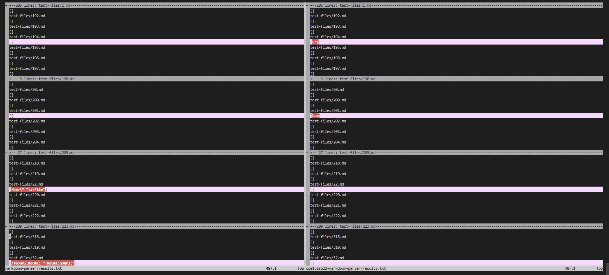
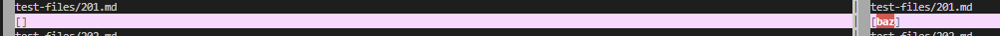
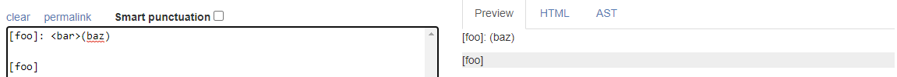
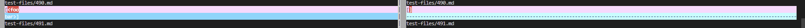
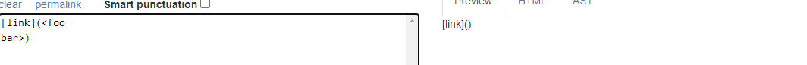

# Lab Report 5
## How I found the test with different results:
I used the `vimdiff` on the `results.txt` files of each respective implementation.


## Test 201.md:
I used `$ bash script.sh > results.txt` for each implementation then `$ vimdiff markdown-parser/results.txt cse15lsp22-markdown-parser/results.txt` and found that the lines with the results of `test-files/201.md` differed for the `results.txt` of the given implementation and my implementation.

[link to 201.md](https://github.com/nidhidhamnani/markdown-parser/blob/main/test-files/201.md)
For 201.md, my markdown-parser was right because the markdown file on github did not display any links and the given markdown-parser believed that (baz) was a valid link despite the `: <baz>` in the middle

The expected output should be `[]`, there are no valid links in the file.

Fix: For the given markdown-parser, instead of looking for a `]` then a `(` and finally a `)` then adding the stuff inside the `(` and `)` as a link, it should look for a `]` then a `](` then a `)` to ensure that there are no spaces or characters between the closing bracket and the parentheses of the link.


```
[foo]: (baz)

[foo]
```


## Test 490.md:
I used `$ bash script.sh > results.txt` for each implementation then `$ vimdiff markdown-parser/results.txt cse15lsp22-markdown-parser/results.txt` and found that the lines with the results of `test-files/490.md` differed for the `results.txt` of the given implementation and my implementation.

[link to 450.md](https://github.com/nidhidhamnani/markdown-parser/blob/main/test-files/490.md)
For 490.md the given markdown-parser was right because the markdown file on github did not display any links (my own markdown-parser counted the `<foo
bar>` as a valid link)

The expected output should be `[]`, there are no valid links in the file.

Fix: For my markdown-parser, instead of just adding what's inside the `(` and `)` of the potential link, we should first trim the string inside the `(` and `)` then check if that trimmed content is a valid link (ie. it has no spaces, no new lines).


```
[link](<foo
bar>)
```

